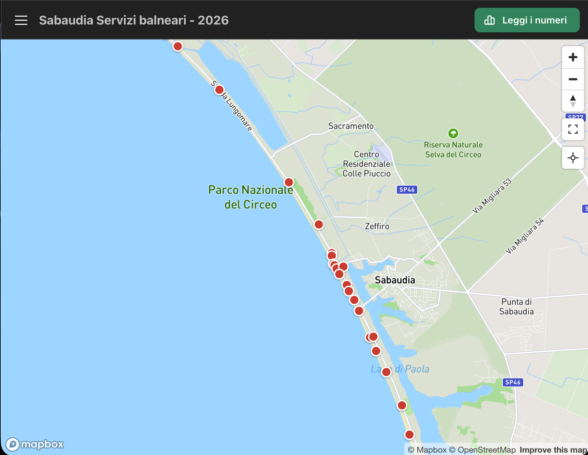

# Sabaudia Beach

<p align="center">
  
</p>

An interactive map of food, drink and restroom service points along the Sabaudia coastline (Latina, Italy). The app answers a simple question: *if I pick a random spot on this beach, how far do I have to walk to reach the nearest service?*

It plots every tracked service point on a Mapbox map, computes coverage gaps, estimates the number of people and the economic opportunity left unserved, and bundles everything into a printable report. Users can adjust the maximum walking time and watch every metric update in real time. A GPS-based "my position" mode shows the nearest services from wherever you are.

---

A mobile-first, client-side React single-page application. No SSR, no backend
server, no database — it runs entirely in the browser and is deployable as a
static site on Vercel.

## Tech stack

- **Vite** — build tool / dev server
- **React 19** + **TypeScript** (strict)
- **Mantine** — UI component library
- **react-map-gl** + **mapbox-gl** — interactive map
- **Biome** — formatter and linter
- **pnpm** — package manager

## Prerequisites

- [Node.js](https://nodejs.org/) 20+ (22+ recommended)
- [pnpm](https://pnpm.io/) 10+ (`corepack enable` or `npm i -g pnpm`)
- A [Mapbox](https://account.mapbox.com/access-tokens/) access token

## Setup

```bash
pnpm install
cp .env.example .env
```

Then open `.env` and set your Mapbox token:

```
VITE_MAPBOX_ACCESS_TOKEN=pk.your_token_here
```

> Without a token the app still runs, but the map area shows a warning instead
> of a map.

